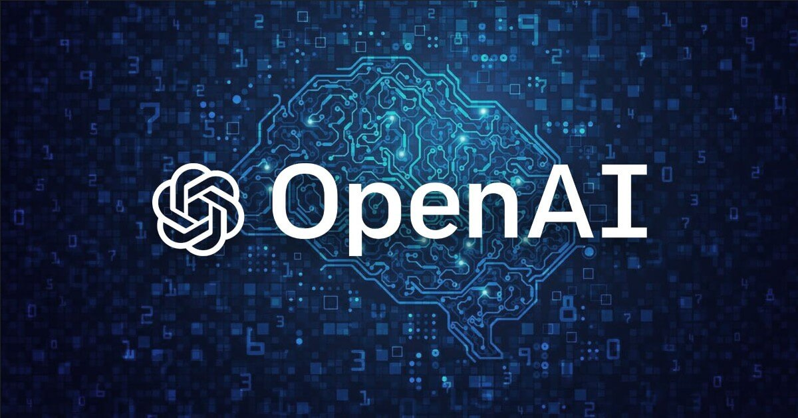

# AISync101

Mobile-first receipt and invoice extraction using the OpenAI API. The app supports photo and PDF uploads, runs extraction on the server, and presents a clean verification UI.

## Run Locally

Prerequisites:
- Node.js (18+)

Steps:
1. Install dependencies:
   `npm install`
2. Set the API key in `.env.local`:
   `OPENAI_API_KEY=YOUR_KEY`
3. Start the app (client + API server):
   `npm run dev`

The UI runs on `http://localhost:3000` and proxies API calls to the local server on port `3001`.

## Build and Run (Production)

1. Build:
   `npm run build`
2. Start the server:
   `npm run start`

## Data Storage (SQLite)

- Receipt history rows are stored in a local SQLite DB: `data/receipts.db`
- OpenAI call history is stored in the same DB (`ai_calls` table)
- Images/PDFs are not saved; they are only held in memory/localStorage during the upload + verify flow

## Render.com (Free Tier) Deploy

Use a single Node.js web service:
- Build command: `npm install && npm run build`
- Start command: `npm run start`
- Environment variables:
  - `OPENAI_API_KEY`
  - Optional: `OPENAI_MODEL` (defaults to `gpt-4o-mini`)

## License

This project is licensed under the MIT License. See `LICENSE`.
